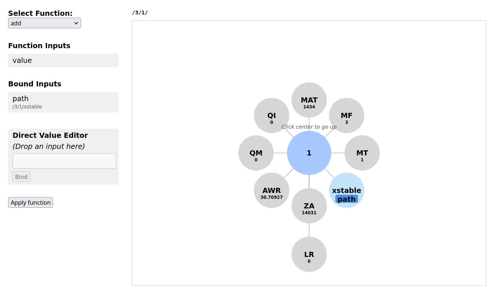

# Patch-based Visual JSON Editor

This is a prototype of a visual JSON editor written in
HTML and JavaScript, using the [D3js](https://d3js.org) library.
It runs directly in a web browser. This project uses an
extended version of the JSON patch format to support
higher-level data transformations.
At present, the prototype only demonstrates the graphical interface
and user interaction with the data, but does not yet support editing.

The nested structure of a JSON file is displayed as a graph
with the current node centered and its child nodes
arranged in concentric circles. Users can navigate
up and down the nested structure by clicking on nodes.

Modifications to the JSON file are described by a collection
of extended JSON patch operations. A user can select an operation
from a drop-down element and then assign nodes to input arguments
by dragging input arguments and dropping them onto specific nodes. 
Once all input arguments are bound, thus the operation configured,
a click on the `Apply function` button adds it to the JSON patch, which is
also shown in the graphical interface.

## Screenshot

Below is an example of the visual JSON editor in action:



## How to try it out

Due to the loading of JSON files which are in the same directory as the html file
or in a subdirectory, you'll need to start a local web server to avoid CORS restrictions
from blocking the loading.

If you have Python installed, one of the easiest ways to start a local web server is
to execute the following from the command line, being in the directory to which this
repository has been downloaded:
```
python -m http.server
```

Then, open your web browser and go to:
```
http://localhost:8000/
```
and click on the `simple-json-editor.html` file.

You can also achieve the same result in one go by entering the url:
```
http://localhost:8000/simple-json-editor.html
```

If you want to try it out with other JSON files, add the `file` parameter to the URL,
for example:
```
http://localhost:8000/simple-json-editor.html?file=nuclear-data/n-014_Si_031.json
```

## Extended JSON Patch Format

The JSON Patch format specified in [RFC 6902](https://www.rfc-editor.org/rfc/rfc6902)
provides operations to add, replace and remove elements whose locations in
a JSON object are referenced by JSON pointers ([RFC 6901](https://www.rfc-editor.org/rfc/rfc6901)).
In addition, operations exist for copying and moving elements from one location
to another one.

While this basic set of operations is sufficient to describe arbitrary transformations,
their low-level nature can obfuscate the semantics of an underlying higher-level operation.
For instance, scaling each element of an array by a factor of 1.2 could be implemented by
a sequence of JSON patch `replace` operations whose arguments are the JSON pointers to the
elements in the array and the new values. However, the essential information that the
new values are the result of scaling the old values by a certain factor is not captured by
these replace operations.

Therefore, operations have been added to extend the JSON patch format to a full
[Turing-complete](https://en.wikipedia.org/wiki/Turing_completeness) programming language.
A prototype of an interpreter for this language called [JotVM](https://github.com/CodeVisionaries/jotvm) is available. 
This extension allows users to define functions for more sophisticated transformations,
making the operations more semantically expressive.
For instance, the definition and use of a function called `scale-array` with an
argument `path` and `factor` makes it immediately obvious that the array located
at the JSON pointer stored in `path` should be scaled by the value assigned to `factor`.
The flexibility and universal expressiveness of the extended JSON patch language
ensures that users can write functions that represent their mental level of
abstraction for the transformation.

## Further remarks

One motivation for creating this prototype has been to support
[WPEC SG54](https://www.oecd-nea.org/jcms/pl_23072/working-party-on-international-nuclear-data-evaluation-co-operation-wpec)
in the development of an automatically readable, comprehensive and curated experimental
reaction database.

If you have design ideas that could improve the user experience with such an editor,
do not hesitate to create an issue or pull request to get the discussion started.

The HTML and JavaScript code was developed with substantial assistance from the
public version of ChatGPT.

## License

This code is provided under the MIT license.

## Similar Projects (assembled by ChatGPT)

Below is a selection of tools and projects related to JSON visualization and editing. While some offer JSON graph views or support for JSON Patch operations, none appear to combine all features of this prototype—namely, visual graph navigation, drag-and-drop binding of inputs to extended JSON patch operations, and semantic abstraction.

| Tool | Description | Similarities | Differences |
|------|-------------|--------------|-------------|
| [**JSON Crack**](https://jsoncrack.com) | An interactive graph visualizer for JSON data with an intuitive layout and navigation. | Visual representation of nested JSON as graphs, interactive navigation. | No patch-building functionality; lacks support for patch semantics or input binding. |
| [**jsonpatch.me**](https://jsonpatch.me) | A web tool to apply and preview JSON Patch operations. | Supports the JSON Patch format and allows users to test patches on JSON inputs. | Operates via text input for patch data; no visual graph or drag-and-drop interface. |
| [**JSON Visio**](https://jsonvisio.toolkits.cn) | A tool to transform JSON into an interactive graph layout. | Provides graph-based view and visual exploration of JSON structures. | Focused on display; lacks patch-based transformation features. |
| [**json-editor**](https://github.com/json-editor/json-editor) | A form-based JSON editor generated from a JSON Schema. | Allows structured editing of JSON via a UI; schema validation. | No graph view or patch tracking; not designed for visual input binding or semantic patch abstraction. |
| [**JSON Patcher**](https://qperez.github.io/json-patcher/) | A simple graphical UI for building JSON Patch operations. | Visual interface for creating patch operations. | Lacks JSON graph representation and semantic operation abstraction; more form-based. |

### How This Project Differs

While each of the tools above offers valuable capabilities, this prototype introduces a unique combination of features:

- **Radial graph layout** of JSON structure with centered current node.
- **Interactive navigation** through the nested JSON by clicking on nodes.
- **Drag-and-drop binding** of input arguments to nodes for JSON Patch operations.
- Support for **extended JSON Patch operations** with named arguments.
- **Patch history tracking** and semantic description of transformations.
- A focus on **capturing high-level meaning** of transformations, not just structural changes.

These features aim to bridge the gap between low-level JSON editing and more expressive, semantically rich transformations—especially useful in domains that require traceable, declarative changes to structured data.

